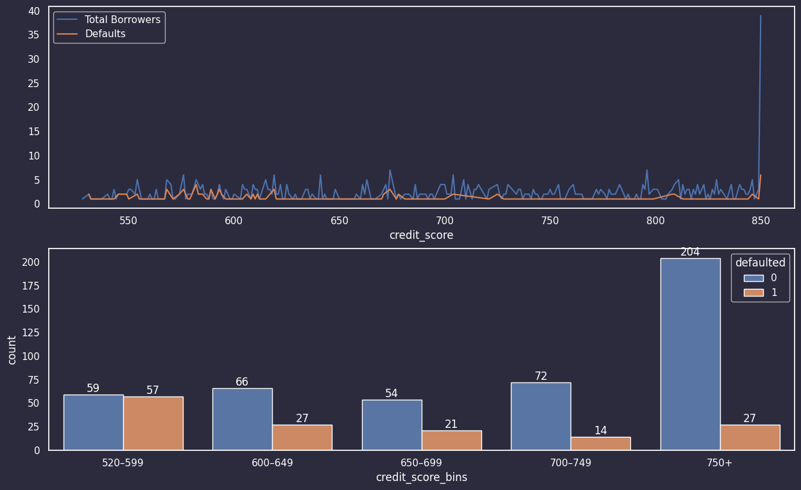
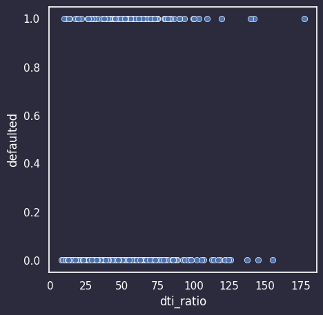
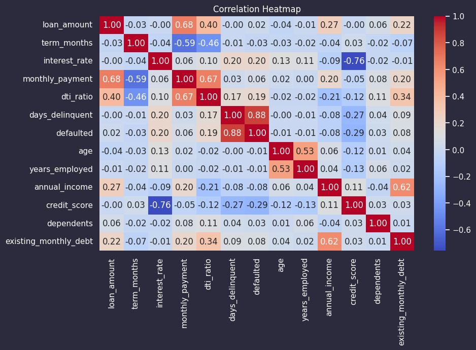
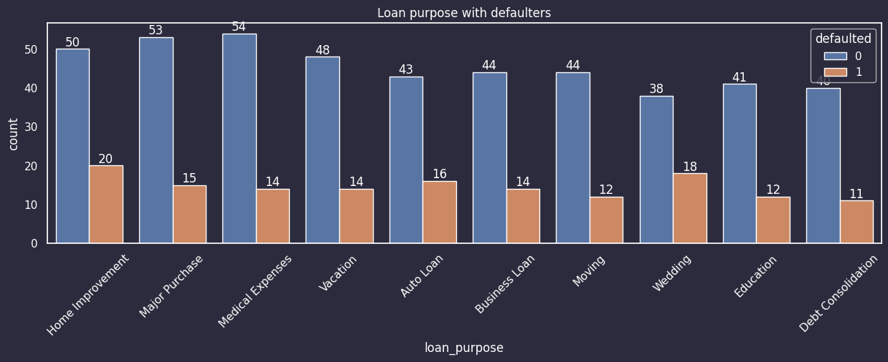
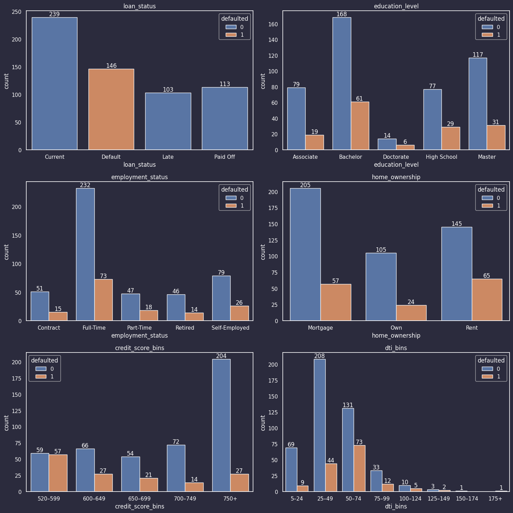

# Loan Default Risk Analysis (EDA Project)

## Overview
This project analyzes borrower and loan application data to identify key factors influencing loan default risk. The goal is to understand financial behavior patterns and improve underwriting decisions.

---

## Problem Statement
To identify major drivers of loan default risk using Exploratory Data Analysis (EDA) and segment borrowers based on credit behavior, DTI ratio, and loan purpose.

---

## Dataset
- Borrower Profiles Dataset  
- Loan Applications Dataset  
- Merged using borrower_id

---

## Tools Used
- Python  
- Pandas  
- NumPy  
- Matplotlib  
- Seaborn  

---

## Key Insights
- Credit score strongly reduces default risk  
- High DTI ratio increases default probability  
- Past delinquency is the strongest predictor  
- Loan purpose impacts risk behavior  
- Financial indicators are more important than demographics  

---

## Visualizations

### Credit Score Analysis

---

### DTI Scatter Plot vs Default

---

### Correlation Heatmap

---

### Loan Purpose vs Default

---

### Category-wise Default Analysis

---

## Recommendations
- Minimum Credit Score: 650  
- Maximum DTI Ratio: 75  
- Strict monitoring for borrowers with past delinquency  
- Focus on financial behavior over demographic features  

---

## Conclusion
Financial behavior indicators such as credit score, DTI ratio, and repayment history are the strongest predictors of loan default risk. These insights can help improve credit risk modeling and lending decisions.

---

## Author
Soban M